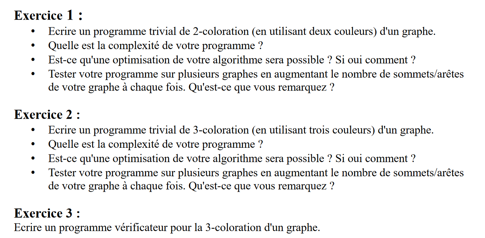

# Graph-Coloration-Project



Note: On décrira par la suite, le graphe par la lettre G, par la variable E le nombre d'*edges* ou d'arêtes donnés par l'utilisateur pour ce graphe G, et par V le nombre de *vertices* ou sommets.

Pour créer un graphe, l'utilisateur pourra donner uniquement les arêtes du graphe car on peut en déduire les sommets, on a donc G=(V,E)=(E)=[E1,E2,...,En].

Les programmes des 3 exercices sont disponibles dans la même racine que ce document dans le fichier coloration.py

## Exercice 1

- La complexité du premier programme était de O(V*E)
- Nous nous sommes rendu compte que le programme était optimisable lors de la recherche des sommets voisins. Dans le premier script, a chaque sommet (donc V fois), nous cherchions les voisins de ce sommets avec la fonction ```G.neighbors(node)``` (de complexité E, car on itère à travers toutes les arêtes). Le problème d'optimisation vient du faite que l'ont itère à travers les arêtes à chaque sommet, alors qu'une seule fois suffit: on peut stocker les voisins sous la forme d'un dictionnaire avec comme clé chaque sommet et comme valeur leurs voisins respectifs. Cette fonction est donné par la fonction ```all_neighbors(G)``` qui est de complexité E, mais qui a besoin d'être appelé une unique fois en début de fonction. On obtient donc finalement avec la fonction ```double_coloration_optimal(G)``` une complexité O(V+E).

##### Ajouter photos de graphes avant et après coloration (Et erreurs) 

## Exercice 2

- Le programme reprend la même base que celui de 2-coloration et rajoute juste un cas dans le *if* final, donc la complexité du programme est la même, c'est-à-dire O(V+E).