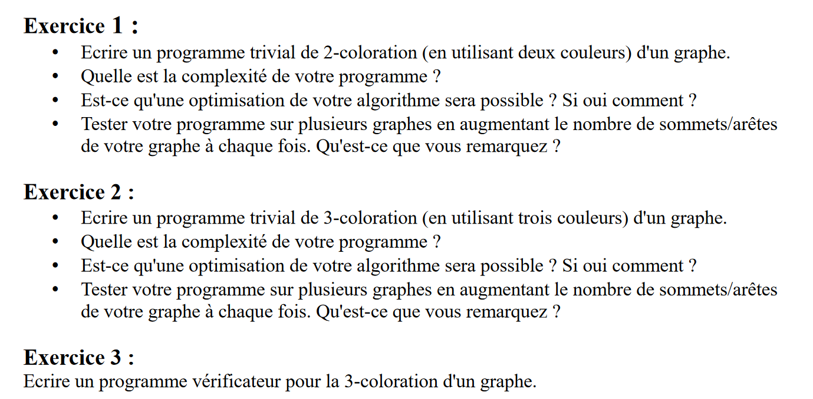
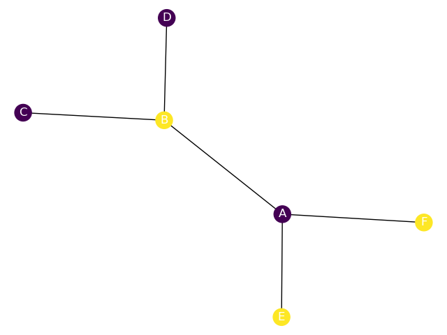
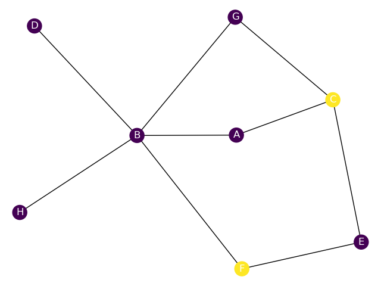
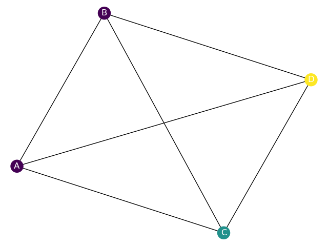

# Graph-Coloration-Project



## Préambule

- On décrira par la suite, le graphe par la lettre G, par la variable E le nombre d'*edges* ou d'arêtes donnés par l'utilisateur pour ce graphe G, et par V le nombre de *vertices* ou sommets.

- Pour créer un graphe, l'utilisateur pourra donner uniquement les arêtes du graphe car on peut en déduire les sommets, on a donc G=(V,E)=(E)=[E1,E2,...,En].

- Les libariries numpy et networkx ont été utilisées pour l'affichage du graphe uniquement 

- Les programmes des 3 exercices sont disponibles dans la même racine que ce document dans le fichier coloration.py

## Exercice 1

- La complexité du premier programme était de O(V*E)

- Nous nous sommes rendu compte que le programme était optimisable lors de la recherche des sommets voisins. Dans le premier script, a chaque sommet (donc V fois), nous cherchions les voisins de ce sommets avec la fonction ```G.neighbors(node)``` (de complexité E, car on itère à travers toutes les arêtes). Le problème d'optimisation vient du faite que l'ont itère à travers les arêtes à chaque sommet, alors qu'une seule fois suffit: on peut stocker les voisins sous la forme d'un dictionnaire avec comme clé chaque sommet et comme valeur leurs voisins respectifs. Cette fonction est donné par la fonction ```all_neighbors(G)``` qui est de complexité E, mais qui a besoin d'être appelé une unique fois en début de fonction. On obtient donc finalement avec la fonction ```double_coloration_optimal(G)``` une complexité O(V+E).

  Une autre possibilité d'optimisation pour réduire les 25\*V de la complexité, nous pourrions passer nos listes python en set, un objet beaucoup moins coûteux en temps car n'acceptant pas de doublons. eg: ```if node in uncolored_neighbors:``` Se réduirait à O(1) et non O(V)



- En utilisant la génération de graphe de ```networkx.generators.random_graphs.erdos_renyi_graph``` , basé sur la génération de graphe (simple, non-orienté mais aussi non connexe) du modèle Erdos-Rényi (https://en.wikipedia.org/wiki/Erd%C5%91s%E2%80%93R%C3%A9nyi_model), on remarque que plus on augmente le nombre p (probabilité de création d'une arête entre 2 nodes), plus il est difficile de coloré le graphe, car il se retrouver très vite dans une position ou 3 sommets sont conjoints.



## Exercice 2

- Le programme reprend la même base que celui de 2-coloration et rajoute juste un cas dans le *if* final, le cas où la node considéré n'a qu'une seule couleur voisine, nous lui attribuons la première couleur possible.

- Le problème avec cette méthode est que le choix d'une couleur changer le rendu final: il faut pouvoir choisir entre les deux pour que le graphe soit colorié. Comme nous ne pouvons pas prévoir quelle couleur est optimale, nous essayons toutes les possibilités (d’où la présence du 2^V dans la complexité) en dupliquant le graphe.

  Le même commentaire peut être fait pour les listes et les sets que dans l'exercice de 2-coloration.

  Nous optenons finalement un algorithme permettant la 3-coloration relativement rapide pour des graphe de l'ordre de la dizaine de nodes: (Ici en n=25 et p=0.1)


- En utilisant la génération de graphe de ```networkx.generators.random_graphs.erdos_renyi_graph``` , on retrouve le même dilemne: plus le nombre de points augmente ou la probabilité de création d'une arête augmente, plus il est difficile de 3-coloré le graphe, car on risque de retrouver un patterne avec 4 sommets conjoints comme suit:

  

  On trouve donc des graphes rapidement impossible à 3-colorer:

  

# Calcul de complexité

### Double coloration

```python
def double_coloration_optimal(G):
	uncolored=G.nodes.copy()	# V
	uncolored_neighbors=[]		# 1
	neighbors=all_neighbors(G) 	# 4*E+1
	while len(uncolored)!=0: 	# 2*V
		if len(uncolored_neighbors)==0: # 2+1
			node=uncolored[0]
		else:
			node=uncolored_neighbors[0]
            
		node_neighbors=neighbors[node]  # 1
		node_neighbors_color=[]			# 1
		for neighbor in node_neighbors: # Worst case is Run for (V-1)
			if neighbor in G.color_map: # 2+1
				node_neighbors_color.append(G.color_map[neighbor])
			else:
				uncolored_neighbors.append(neighbor)
         
		uncolored_neighbors=list(set(uncolored_neighbors)) 		# 3
		node_neighbors_color=list(set(node_neighbors_color)) 	# 3
		if len(node_neighbors_color)>=2:	# 2
			return False					# 1
		else:
			G.setnode_color(node,[x for x in G.two_color if x not in node_neighbors_color][0]) 		# 5
		uncolored.remove(node)	# (V-1)
		if node in uncolored_neighbors: # (V-1)
			uncolored_neighbors.remove(node) #(V-1)
	return True # 1


def neighbors(self,node): #4*E+1
    neighbors=[]
    for edge in self.edges: # run E times
        if node in edge:	
            new_neighbor=list(edge)
            new_neighbor.remove(node)
            neighbors+=new_neighbor
            return neighbors
```

* **La complexité en temps est de au pire 2+25\*V+8V²+4*E, donnant une complexité de O(V²+E) dans le pire des cas, et en moyenne O(V+E)**


### Triple Coloration

```python
def triple_coloration_optimisation(G,uncolored=None,uncolored_neighbors=None,neighbors=None):
	if uncolored==None: 			# 1 (Happens 1 time)
		uncolored=G.nodes.copy() 	# V
		uncolored_neighbors=[] 		# 1
		neighbors=all_neighbors(G) 	# E

	if len(uncolored)==0: 			# 2
		return True					# 1
	if len(uncolored_neighbors)==0:	# 2
		node=uncolored[0]			# 1
	else:
		node=uncolored_neighbors[0]	# 1
	node_neighbors=neighbors[node] 	# 1
	node_neighbors_color=[]			# 1

	for neighbor in node_neighbors:	# (V-1)
		if neighbor in G.color_map: # 3
			node_neighbors_color.append(G.color_map[neighbor]) 	# 1
		else:
			uncolored_neighbors.append(neighbor)				# 1
	uncolored_neighbors=list(set(uncolored_neighbors))			# 3
	node_neighbors_color=list(set(node_neighbors_color))		# 3
	
	if len(node_neighbors_color)>=3:	# 2		
		return False					# 1
	elif len(node_neighbors_color)==1:	# 2
		H=G._copy()						# V
		G.setnode_color(node,[x for x in G.three_color if x not in node_neighbors_color][0]) 		# 7
		H.setnode_color(node,[x for x in G.three_color if x not in node_neighbors_color][1])		# 7
		uncolored.remove(node)																		# (V-1)
		if node in uncolored_neighbors:																# (V-1)
			uncolored_neighbors.remove(node) 														# 1
		return triple_coloration_optimisation(G,copy.deepcopy(uncolored),copy.deepcopy(uncolored_neighbors),neighbors) or triple_coloration_optimisation(H,copy.deepcopy(uncolored),copy.deepcopy(uncolored_neighbors),neighbors) #2*V times with last occurence complexity = O(V)
	else:
		G.setnode_color(node,[x for x in G.three_color if x not in node_neighbors_color][0])		# 7
		uncolored.remove(node)																		# (V-1)
		if node in uncolored_neighbors:																# (V-1)
			uncolored_neighbors.remove(node)														# (V-1)
		return triple_coloration_optimisation(G,uncolored,uncolored_neighbors,neighbors)			# V times
```

**La complexité en temps calculée est donc de 25+20V+V*2^V, donnant une complexité dans le pire des cas de l'ordre O(E+V2^V)**
